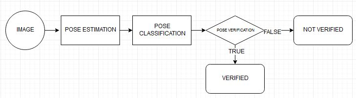
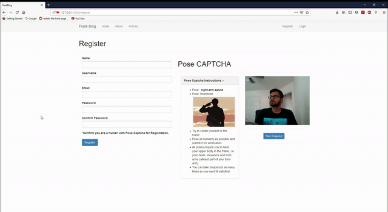

# pose-captcha-flask-blog

CAPTCHAs (Completely Automated Public Turing test to tell Computers and Humans Apart) are tests meant to be easy for humans but hard for machines to solve in order to use an online service. Due to advancements in Artificial Intelligence and its subset technologies like Machine Learning and Deep Learning, solving widely used Image and Text CAPTCHAs are becoming relatively easy with less computational power required. In this project, we introduce a new CAPTCHA based on Pose Estimation from the human user, retaining the property of it being easy for humans, as poses are an intrinsic human characteristic.

Poses are classified based on the output of Pose Estimation and are unique within this CAPTHCA system. This is to maximize the complexity for Machine Vision algorithms at present to crack into. We retain all security features of existing CAPTCHAs and nullify various forms of attacks too. Our system allows for humans to easily pass the test while making it a lot hard for bots or computer programs to solve, making artificial activity in a web application less rampant.

# Architecture 

# Demo 

## References
[references.txt](./references.txt)
